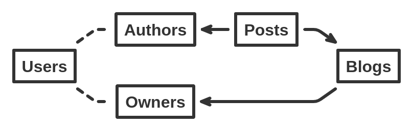

<h1 align="center">
    <a href="https://github.com/vazco">vazco</a>/sparrowql
</h1>

<p align="center">
    
</p>

<p align="center">
    <strong>Declarative MongoDB aggregations.</strong>
</p>

<p align="center">
    <strong><a href="https://github.com/vazco/sparrowql/blob/master/.github/CONTRIBUTING.md">Contribute</a></strong> |
    <strong><a href="#usage">Usage</a></strong> |
    <strong><a href="https://github.com/vazco/sparrowql/blob/master/INTRODUCTION.md">Documentation</a></strong> |
    <strong><a href="https://github.com/vazco/sparrowql/blob/master/FAQ.md">FAQ</a></strong>
</p>

<p align="center">
    <a href="https://codecov.io/gh/vazco/sparrowql">
        
    </a>
    <a href="https://npmjs.org/package/sparrowql">
        
    </a>
    <a href="https://npmjs.org/package/sparrowql">
        
    </a>
    <a href="https://vazco.eu">
        
    </a>
    <a href="https://github.com/vazco/sparrowql/discussions">
        
    </a>
    <a href="https://npmjs.org/package/sparrowql">
        
    </a>
    <a href="https://github.com/vazco/sparrowql/actions?query=branch:master">
        
    </a>
</p>

# What's included?

- **Automatic `$lookup` only if needed**
- **Declarative pipelines generation**
- **Optimized for multi-collection queries**

## Reasons to use SparrowQL

SparrowQL was created to make your work with **multi-collection queries** much easier and convenient. SparrowQL is an alternative way to make your aggregation pipeline easier to read and maintain. The most significant profits are the **less time spent on pipelining queries** and a **boost on performace**.

## Installation

```sh
npm install sparrowql
```

## Usage

Here are a few easy steps to start your work with sparrowql.

If you want to create new queries with SparrowQL, you need a query build function

```js
import { build } from "sparrowql";
```

#### How to build sparrowql query?

**_Basic example_**

Imagine you have a simple db model:

<be>


And a some fixtures for it:

```js
const blogs = [{ _id: 0, ownerId: 3, topic: "Best blog!" }];
const posts = [
  { _id: 0, authorId: 0, blogId: 0, title: "Being fast for dummies" },
  { _id: 1, authorId: 0, blogId: 0, title: "Being declarative" },
  { _id: 2, authorId: 1, blogId: 0, title: "Amazing!" },
  { _id: 3, authorId: 2, blogId: 0, title: "A sparrow, really?" },
  { _id: 4, authorId: 1, blogId: 0, title: "Best!" },
  { _id: 5, authorId: 1, blogId: 0, title: "Superb!" }
];
const users = [
  { _id: 0, name: "SparrowQL", about: "Declarative aggregations" },
  { _id: 1, name: "Random #1", about: "Node.js developer" },
  { _id: 2, name: "Random #2", about: "Bird lover" },
  { _id: 3, name: "BlogOwner", about: "Owner of the blog" }
];
```

Now you want to create a query to get all the data you need e.g.
Let's say you want to receive _all the posts' titles written on blogs with blogs' topics._ What do we need to make it work? To build a simple pipeline, you need a few arguments to the `build` function:

- `projection` - pick the fields you need

```js
const projection = {
  blogTopic: "Blogs.topic",
  postTitle: "Posts.title"
};
```

- `relations` - define relations between collections

```js
const relations = [
  { to: "Blogs", from: "Posts", foreign: "_id", local: "blogId" },
  { to: "Users", from: "Blogs", foreign: "_id", local: "ownerId" },
  { to: "Users", from: "Posts", foreign: "_id", local: "authorId" }
];
```

- `start` - what is the main collection you want to start from

```js
const start = "Posts";
```

Now you only need to build your new pipeline:

```js
const pipeline = build({ projection, relations, start });
const results = await Posts.aggregate(pipeline).toArray();
// Results
[
  { blogTopic: "Best blog!", postTitle: "Being fast for dummies" },
  { blogTopic: "Best blog!", postTitle: "Being declarative" },
  { blogTopic: "Best blog!", postTitle: "Amazing!" },
  { blogTopic: "Best blog!", postTitle: "A sparrow, really?" }
];
```

**_Aliases - example_**

SparrowQL works correctly only on [directed trees](<https://en.wikipedia.org/wiki/Tree_(graph_theory)>) - in this case, you want to create a _query which takes all the posts that were posted on someone's blog and the name of the blog owner_. To make it work, you need to use **aliases**. Here is an example:



The only thing to do is to create aliases:

```js
const aliases = {
  Authors: "Users",
  Owners: "Users"
};
```

And here is the rest of the query:

```js
const projection = {
  ownerName: "Owners.name",
  postTitle: "Posts.title"
};
const start = "Posts";
const pipeline = build({ aliases, projection, relations, start });
const results = await Posts.aggregate(pipeline).toArray();
// Results
[
  { ownerName: "BlogOwner", postTitle: "Being fast for dummies" },
  { ownerName: "BlogOwner", postTitle: "Being declarative" },
  { ownerName: "BlogOwner", postTitle: "Amazing!" },
  { ownerName: "BlogOwner", postTitle: "A sparrow, really?" }
];
```

<br>

SparrowQL also may provide you with few other stages you might want to use:

- **sort** - handle sort, which maps to [_\$sort_](https://docs.mongodb.com/manual/reference/operator/aggregation/sort/index.html) directly
- **query** - handle query, which maps to [_\$match_](https://docs.mongodb.com/manual/reference/operator/aggregation/match/index.html) directly\*
- **limit** - handle limit, which maps to [_\$limit_](https://docs.mongodb.com/manual/reference/operator/aggregation/limit/index.html) and [_\$skip_](https://docs.mongodb.com/manual/reference/operator/aggregation/skip/index.html) directly\*

_\* They may result in more than one phase._

**_More complex example with other stages_**

<details>
<summary>Example</summary>

```js
const limit = 1;
const projection = {
  blogOwnerName: "Owners.name",
  postAuthorName: "Authors.name",
  postTitle: "Posts.title"
};
const query = { "Authors.name": "Random #1" };
const skip = 1;
const sort = { "Posts.title": -1 };
const start = "Posts";
const pipeline = build({
  aliases,
  limit,
  projection,
  query,
  relations,
  skip,
  sort,
  start
});
const results = await Posts.aggregate(pipeline).toArray();
[
  {
    blogOwnerName: "BlogOwner",
    postAuthorName: "Random #1",
    postTitle: "Best!"
  }
];
```

</details>
<br>

[If you want to see a more detailed description, please see this article](https://medium.com/vazco/dynamic-aggregations-with-sparrowql-dfeb133821e7) or [check all the examples to get familiar with SparrowQL](https://github.com/vazco/sparrowql/tree/master/__tests__)

# License


**Like every package maintained by [Vazco](https://vazco.eu/), sparrowql package is [MIT licensed](https://github.com/vazco/sparrowql/blob/master/LICENSE).**
